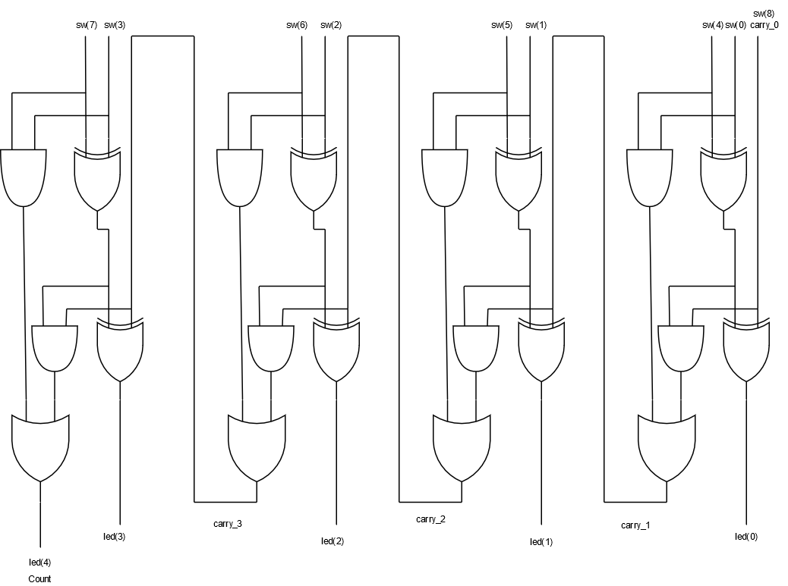

# Entrega 1-C de Javiera Inostroza Ríos

## Módulos

### fulladder4.vhd:
	   

 Módulo que recibe la señal de 9 switches y entrega el resultado de la suma de los cuatro primeros más los 4 siguientes más el switch carry (el siguiente), a través de leds en forma binaria (5 bits) y a través del display en forma decimal. 

	   
           
`
sw : in STD_LOGIC_VECTOR (8 downto 0);
           
led : out STD_LOGIC_VECTOR (4 downto 0);
           
clk : in STD_LOGIC;
           
seg : out STD_LOGIC_VECTOR (6 downto 0);
           
an : out STD_LOGIC_VECTOR (3 downto 0));

`

### binary_bcd_decoder.vhd:

	

 Decodifica la señal de 5 bits (resultante de la suma), en su equivalente BCD, separando la decena de la unidad. 

`	 
n       : in  STD_LOGIC_VECTOR (4 downto 0);
	 
dec : out STD_LOGIC_VECTOR (3 downto 0);
	 
unit    : out STD_LOGIC_VECTOR (3 downto 0);
           
`

### Display_Controller.vhd:
	

 Codifica los valores que quieres entregar en los display 7 segmentos. 

	
`        
dis_a       : in   STD_LOGIC_VECTOR (3 downto 0);
        
dis_b       : in   STD_LOGIC_VECTOR (3 downto 0);
        
dis_c       : in   STD_LOGIC_VECTOR (3 downto 0);
        
dis_d       : in   STD_LOGIC_VECTOR (3 downto 0);
        
clk         : in   STD_LOGIC;
        
seg         : out  STD_LOGIC_VECTOR (6 downto 0);
        
an          : out  STD_LOGIC_VECTOR (3 downto 0);

`

## Circuito

# Importante!!

### En el módulo Display_Controller.vhd modifiqué algunas líneas:

 
- Línea 14 (Dentro del port):
	
	**antes:**     seg   :   out  STD_LOGIC_VECTOR (7 downto 0);
	
	**ahora:**    seg   :   out  STD_LOGIC_VECTOR (6 downto 0);
 
- Líneas 57 - 67 (dentro del "with number select seg <= ", a todos los números de 8 bits les eliminé el primer bit, 
dejándolos de 7).
 

**ahora:**
 
 `
"1000000" when "0000",
                
"1111001" when "0001",
                
"0100100" when "0010",
                
"0110000" when "0011",
                
"0011001" when "0100",
                
"0010010" when "0101",
                
"0000010" when "0110",
                
"1111000" when "0111",
                
"0000000" when "1000",
                
"0010000" when "1001",
                
"1111111" when others;

`
